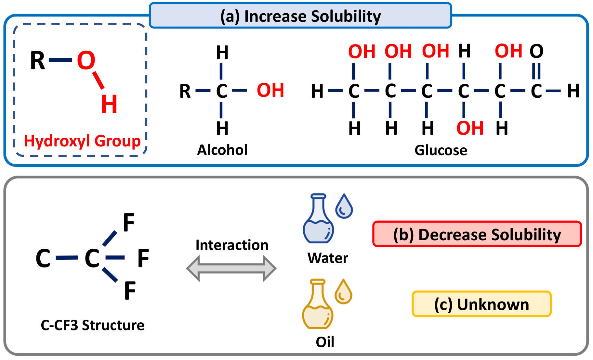

# Conditional Graph Information Bottleneck for Molecular Relational Learning

<p align="center">   
    <a href="https://pytorch.org/" alt="PyTorch">
      </a>
    <a href="https://icml.cc/" alt="Conference">
        </a>
</p>

The official source code for [**Conditional Graph Information Bottleneck for Molecular Relational Learning**](https://arxiv.org/abs/2305.01520), accepted at ICML 2023.

## Overview
Molecular relational learning, whose goal is to learn the interaction behavior between molecular pairs, got a surge of interest in molecular sciences due to its wide range of applications.
Recently, graph neural networks have recently shown great success in molecular relational learning by modeling a molecule as a graph structure, and considering atom-level interactions between two molecules.
Despite their success, existing molecular relational learning methods tend to overlook the nature of chemistry, i.e., a chemical compound is composed of multiple substructures such as functional groups that cause distinctive chemical reactions
In this work, we propose a novel relational learning framework, called CGIB, that predicts the interaction behavior between a pair of graphs by detecting core subgraphs therein.
The main idea is, given a pair of graphs, to find a subgraph from a graph that contains the minimal sufficient information regarding the task at hand conditioned on the paired graph based on the principle of conditional graph information bottleneck.
We argue that our proposed method mimics the nature of chemical reactions, i.e., the core substructure of a molecule varies depending on which other molecule it interacts with. 
Extensive experiments on various tasks with real-world datasets demonstrate the superiority of CGIB over state-of-the-art baselines.

</img> 

**a) Molecules with hydroxyl group have high aqueous solubility. (b) C-CF3 structure decreases the solubility of molecules in water. (c) However, it is not crucial in determining the solubility of molecules in oil.**

### Requirements

- Python version: 3.7.10
- Pytorch version: 1.8.1
- torch-geometric version: 1.7.0

### How to Run the code?

Please refer to the README.md file in each task folder for further instructions and details on how to run the code.

### Cite (Bibtex)
- If you find ``CGIB`` useful in your research, please cite the following paper:
  - Namkyeong Lee, Dongmin Hyun, Gyoung S. Na, Sungwon Kim, Junseok Lee, and Chanyoung Park. "Conditional Graph Information Bottleneck for Molecular Relational Learning." ICML 2023.
  - Bibtex
```
@article{lee2023conditional,
  title={Conditional Graph Information Bottleneck for Molecular Relational Learning},
  author={Lee, Namkyeong and Hyun, Dongmin and Na, Gyoung S and Kim, Sungwon and Lee, Junseok and Park, Chanyoung},
  journal={arXiv preprint arXiv:2305.01520},
  year={2023}
}
```